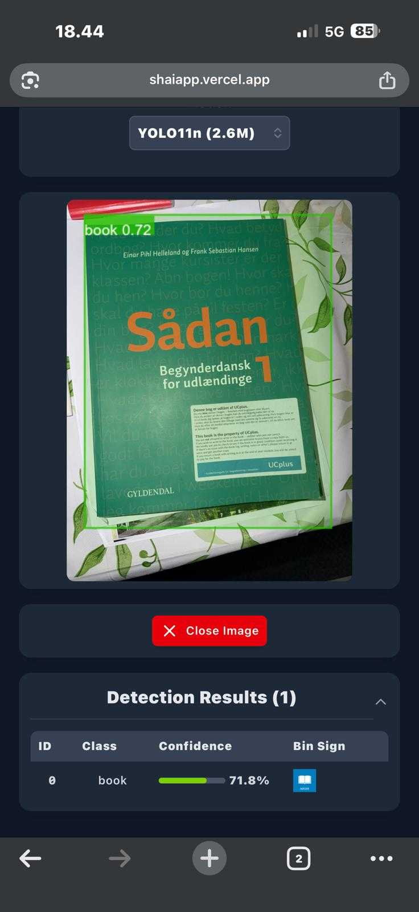

# SHAI — South Harbour AI App for Sustainable Recycling

Welcome to the SHAI App 👋  
This project is a **student prototype** developed at **Aalborg University (Copenhagen Campus)** as part of the Sustainable Development Lab (Autumn 2025).  
Our mission is to combine **AI-powered object detection** with **user-centered design** to make recycling easier, smarter, and more engaging.

---
## 📸 Preview

Here’s a quick look at the SHAI App interface:

<div align="center">


<br>

</div>

## 📱 Visit via QR Code

Scan this QR code to open the SHAI App directly in your browser:

<div align="center">


<br>

</div>

---

## 🌍 Project Background

SHAI was born from a collaboration with the **South Harbor Waste Management Facility** in Copenhagen.  
The facility faces challenges in motivating citizens to recycle correctly and consistently.  
Our solution: a web-based tool that helps users **scan household waste** and instantly see which container it belongs to.

This project is inspired by:
- The **UN Sustainable Development Goals (SDGs)**  
- **Circular Economy principles** (Regenerate, Narrow, Slow, Close, Inform)  
- **Education for Sustainable Development (ESD) competencies**  

---

## ✨ Features

- 📷 **Live Camera Capture** — Scan waste in real time using your device’s camera (Future Work).  
- 🖼️ **Image Upload** — Upload photos of trash to detect recyclable categories.  
- 🎥 **Video Upload** — Run detection on video files for batch analysis (Future Work).  
- 🗂️ **Dynamic Results Table** — See detected items, confidence scores, and recommended bins.  
- 📅 **Integrated Calendar** — Track recycling events, updates, and community activities.  
- 🌐 **Multilingual Project Description** — English and Danish versions for local impact.  

---

## 🚀 How It Works

1. Open the SHAI app in your browser.  
2. Take a picture of your waste or upload an image/video.  
3. The app uses **YOLO object detection models (ONNX Runtime)** to classify items.  
4. Results are displayed with confidence scores and container recommendations.  
5. If detection fails, try another angle — the system improves with feedback.  

---

## 👩‍💻 Team

- **Mahadi Hasan Sany** — Prototype Development & Coordination 
- **Mathias Lind** — Coordination  
- **Anders Kassa Häggquist** — Coordination   

📧 Contact:  
- Sany — [msany24@student.aau.dk](mailto:msany24@student.aau.dk) 
- Mathias — [mlyngs24@student.aau.dk](mailto:mlyngs24@student.aau.dk)  
- Anders — [ahaggq24@student.aau.dk](mailto:ahaggq24@student.aau.dk)  
 

---

## 🌱 Why It Matters

Recycling is not just about sorting waste — it’s about **changing behavior**.  
SHAI bridges the gap between **technology and human motivation**, helping communities become more sustainable.  
Even small local actions can inspire global change 🌍.

---

## 🛠️ Tech Stack

- **React + Vite** — Frontend framework  
- **Tailwind CSS** — Styling  
- **ONNX Runtime Web** — AI inference in the browser  
- **YOLO Models** — Object detection  
- **JavaScript (ES6+)** — Core logic  


---
## 🛠️ Installation

1. **Clone the repository**

   ```bash
   git clone https://github.com/sanyhmahadi/shaiapp.git
   ```

2. **Navigate to project directory**

   ```bash
   cd shaiapp
   ```

3. **Install dependencies**

   ```bash
   yarn install
   ```

4. **Run Development Server**

   ```bash
   yarn dev
   ```

5. **Build for Production**
   ```bash
   yarn build
   ```
---

## 📅 Future Perspectives

- Expand detection classes for more waste categories though the custom train model and dataset.  
- Improve accuracy with community feedback.  
- Scale the app for use in municipalities across Denmark and beyond.  
- Explore gamification to motivate recycling habits.  

---

## 🙌 Acknowledgements

This project was developed as part of the **Sustainable Development Lab (Autumn 2025)**.  
Special thanks to the **South Harbor Waste Management Facility** for their collaboration and insights.  

---

> “Waste is only waste if you waste it🙄”  
> — SHAI Team
